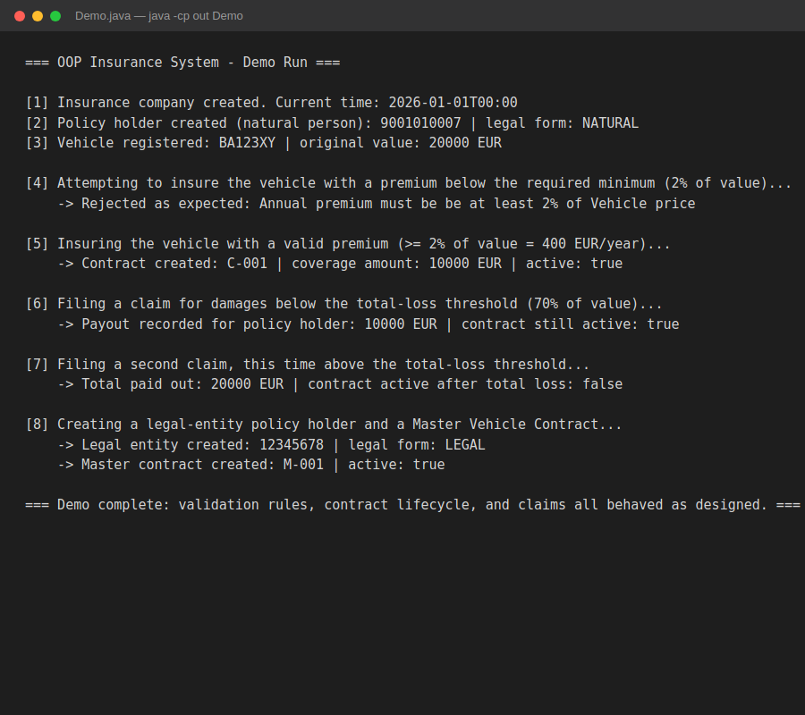

# OOP Insurance System

Implementation of a simplified insurance system, based on the official B-OOP 2025 semester assignment from FEI STU. The system models insurance contracts, payments, vehicles, persons, and claims according to a detailed UML diagram and strict behavioral rules.

## Demo Run

The project has no graphical or web interface by design (it's a pure domain-model/OOP exercise, validated primarily through unit tests). Below is a console demo (`Demo.java`) exercising the core flow end to end: company setup, a natural person with a validated Slovak birth number, a vehicle, business-rule validation, contract creation, and claim processing through to a total-loss scenario.



## What the demo shows

- **Validation rules are enforced, not just modeled** — attempting to insure a vehicle with a premium below the required 2% minimum is correctly rejected with a clear exception message.
- **Slovak birth number validation** — `Person` validates the national ID format including the checksum digit, and infers legal form (natural vs. legal person) automatically.
- **Contract lifecycle** — a claim below the total-loss threshold (70% of vehicle value) pays out but keeps the contract active; a claim above that threshold deactivates it.
- **Composition over duplication** — `MasterVehicleContract` and `SingleVehicleContract` share behavior through `AbstractContract` rather than duplicating logic.

## Project Structure

```
src/main/java/
  company/InsuranceCompany.java       Core orchestration: issuing contracts, charging premiums, processing claims
  contracts/                          AbstractContract and its subtypes (Single/Master Vehicle, Travel)
  objects/                            Person, Vehicle, LegalForm
  payment/                            Payment handling, payment frequency, contract payment data
src/test/java/
  RequiredTests.java, AiBasedTests.java   JUnit 5 test suites
Demo.java                             Standalone console demo (no external dependencies)
```

## Running the demo locally

The main source has no external dependencies, so it compiles with plain `javac`:

```bash
mkdir -p out
javac -d out -encoding UTF-8 $(find src/main/java -name "*.java")
javac -d out -encoding UTF-8 -cp out Demo.java
java -cp out Demo
```

## Running the test suite

The test suite uses JUnit 5 via Maven:
